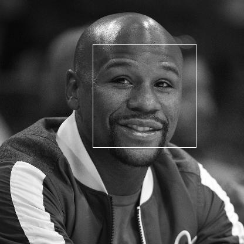

# openCV_detect_faces_function
The OpenCV library contains mechanisms to do face detection on images. The technique used is based on Haar cascades, which is a machine learning approach.
OpenCV comes with trained models for detecting faces, eyes, and smiles which we'll be using.
You can train models for detecting other things and if you're interested in that I'd recommend you check out the Open CV docs on 
#### how to train a cascade classifier: 
https://docs.opencv.org/3.4/dc/d88/tutorial_traincascade.html

### .py code requirements
1. Python 3.6 or above
2. OpenCV module ver 3.6 or above

### In this code I managed to detect faces of some images 

## Thanks to the course "Python Project: pillow, tesseract, and opencv" Instructions which helped me a lot to understnad/build many things.
#### *This course is part of the "Python 3 Programming Specialization" by University of Michigan.
#### https://www.coursera.org/learn/python-project/home/welcome
